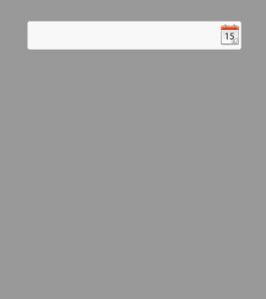

# datepick
JavaScript原生日期选择插件

##Example



##How To Use

引入必须的CSS文件

```javascript
<script src="js/datapick.js"></script>
<script>
    new Calendar({
        targetInput: document.getElementById('in'),
    });
</script>
```

##Options

默认的配置如下：

```javascript
var defaultConf = {
    targetInput : '',
    beginYear: 1901,
    endYear: 2099,
    type: 'yyyy-mm-dd',
    firDayOfWeek: 1,
    language: {
        year: '年',
        month: '月',
        monthList: ['1月', '2月', '3月', '4月', '5月', '6月', '7月', '8月', '9月', '10月', '11月', '12月'],
        weekList:[ '日', '一', '二', '三', '四', '五', '六'],
        time: '时间',
        today: '今天',
        clear: '清除'
    }
};
```

* targetInput：目标文本
* beginYear：开始年份
* endYear：结束年份
* type：日期显示格式
* firDayOfWeek：一周以周几开始显示 {1:'周一', 2:'周二', 3:'周三', 4:'周四', 5:'周五', 6:'周六', 0:'周日'}
* language: 设置日期面板显示语言

##License

[MIT](LICENSE)
